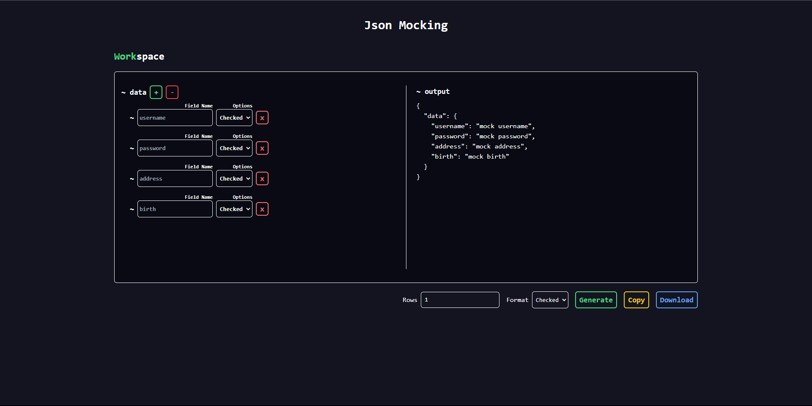

# Mocking JSON Website with React, TypeScript, and Vite

## Description

I created this project to demonstrate how to set up a modern web development environment using React, TypeScript, and Vite. The goal is to provide a hands-on example of how to create a mock JSON website, which can be particularly useful for front-end developers who need to simulate data fetching and handling in their applications.

By following this guide, developers can learn how to:

- Quickly scaffold a new React project using Vite
- Configure TypeScript for type-safe development
- Create and use mock JSON data
- Fetch and display data in a React component

This project serves as a starting point for anyone looking to learn or improve their skills in modern web development with these technologies. It can also be extended to handle more complex scenarios and data structures, making it a versatile foundation for building more sophisticated applications.

## Prerequisites

Before you begin, make sure you have the following installed on your system:

- [Node.js](https://nodejs.org/) (version 14 or later)
- [npm](https://www.npmjs.com/) or [Yarn](https://yarnpkg.com/)